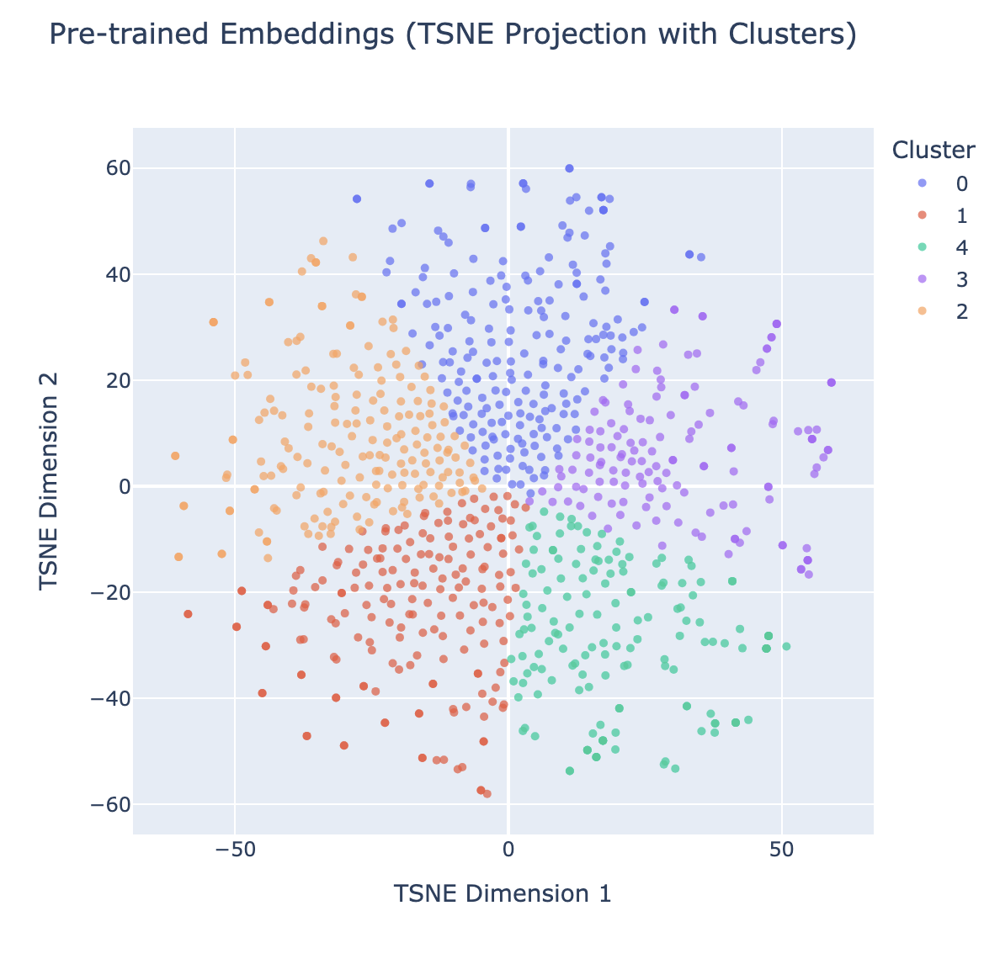
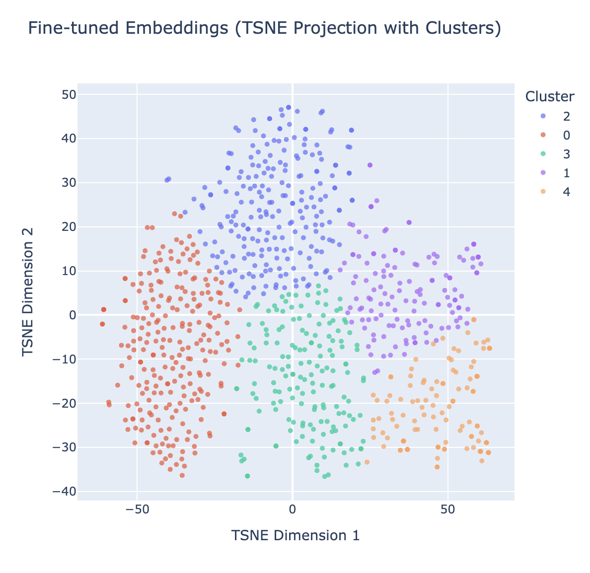

## Descrição Dataset

O dataset utilizado neste projeto, sephora_reviews.csv, contém avaliações de produtos da Sephora. Cada entrada inclui uma avaliação textual, que pode abordar aspectos variados do produto, como qualidade, eficácia e satisfação do usuário. Essas avaliações são valiosas para entender as opiniões dos clientes e identificar padrões no feedback, pois fornecem informações textuais não estruturadas que refletem as experiências e sentimentos dos diferentes usuários. Este dataset é adequado para análise de embeddings, pois permite explorar as relações semânticas entre as avaliações.

---

## Processo de Geração de Embedding

Para gerar embeddings, utilizamos inicialmente o modelo pré-treinado SBERT (paraphrase-MiniLM-L6-v2), que transforma cada avaliação em um vetor de 384 dimensões, capturando relações semânticas gerais. Em seguida, aplicamos um autoencoder com funções de ativação ReLU nas camadas ocultas para refinar esses embeddings para nosso dataset específico. A arquitetura do autoencoder consiste em um encoder que reduz a dimensionalidade de 384 para 256 e depois para 128, seguido por uma camada de espaço latente com 128 dimensões. O decoder então reconstrói os embeddings, expandindo novamente para 256 e finalmente para 384 dimensões. Essa arquitetura permite que o autoencoder aprenda uma representação compacta que enfatiza as características relevantes das avaliações da Sephora. O modelo foi treinado com uma taxa de aprendizado de 0.001 por 30 épocas.

  

---

## Training Process
O autoencoder foi treinado utilizando o erro quadrático médio (MSE) como função de perda, que mede a diferença média ao quadrado entre os embeddings originais e suas versões reconstruídas. Essa função de perda é apropriada para nossa tarefa, pois incentiva o modelo a minimizar o erro de reconstrução, garantindo que o autoencoder capture as informações essenciais dos embeddings enquanto remove ruídos e enfatiza características específicas do dataset. Ao minimizar o MSE, o modelo aprende a gerar embeddings mais significativos no contexto das avaliações de produtos, facilitando a análise de similaridade e o agrupamento.

Equação: A função de perda de erro quadrático médio (MSE) $L$ é definida como:

$$L = \frac{1}{n} \sum_{i=1}^{n} (x_i - \hat{x}_i)^2$$

onde $ x_i $ é o valor original do embedding e $ \hat{x}_i $ é o valor reconstruído e $n$ é o número total de elementos no embedding.

---

## Visualização dos Embeddings

1. **Pre-Trained Embeddings**

     

   O gráfico mostra os embeddings gerados pelo modelo SBERT pré-treinado. Cada ponto no gráfico representa uma avaliação, com sua posição determinada pelo embedding inicial gerado pelo SBERT. 

2. **Fine-Tuned Embeddings**

     

   O gráfico mostra os embeddings após o ajuste fino pelo autoencoder. Este ajuste visa tornar os embeddings mais representativos das características específicas do dataset da Sephora, aproximando avaliações semelhantes e destacando nuances relevantes no espaço vetorial.

## Discussão

Na **Figura 1**, observamos os embeddings pré-treinados do SBERT projetados em duas dimensões. Esses embeddings apresentam clusters visíveis, o que indica que o modelo SBERT foi capaz de capturar algumas relações semânticas gerais entre as avaliações. No entanto, também é perceptível uma certa sobreposição entre clusters, o que sugere que o modelo não distingue completamente temas específicos das avaliações da Sephora. Isso é esperado, já que o SBERT é um modelo genérico, pré-treinado para capturar semântica ampla, mas não ajustado para o contexto específico das avaliações de produtos de beleza. Os clusters que aparecem podem estar mais relacionados a características linguísticas gerais, como diferenças de estilo de escrita ou variações comuns em avaliações de produtos, do que a categorias específicas, como tipos de produtos ou sentimentos claros expressos nas avaliações. Em resumo, os embeddings pré-treinados fornecem uma base útil, mas ainda não totalmente ajustada para capturar nuances e contextos específicos do dataset.

Na **Figura 2**, vemos os embeddings ajustados pelo autoencoder, que exibe uma organização de clusters mais coesa e bem definida. A separação mais clara entre clusters indica que o processo de ajuste fino ajudou o autoencoder a captar características e padrões específicos do dataset de avaliações da Sephora. Esses clusters provavelmente refletem temas específicos, como categorias de produtos, sentimentos (positivos, negativos, neutros) ou tópicos recorrentes nas avaliações, como qualidade do produto, eficácia ou relação custo-benefício. O fato de os clusters estarem mais definidos e com menos sobreposição sugere que o autoencoder conseguiu ajustar os embeddings de modo a amplificar diferenças relevantes no contexto das avaliações. Assim, esses embeddings ajustados são mais eficazes para tarefas de análise de similaridade e agrupamento, pois refletem com mais precisão as nuances do domínio das avaliações de produtos de beleza, tornando-os mais úteis para sistemas de recomendação ou para explorar insights específicos sobre o comportamento do consumidor.
