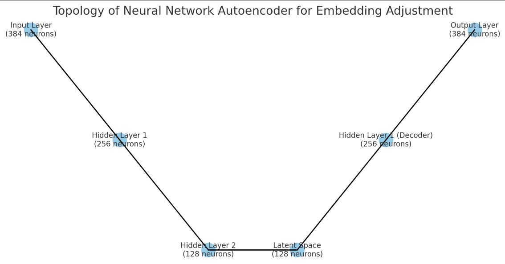
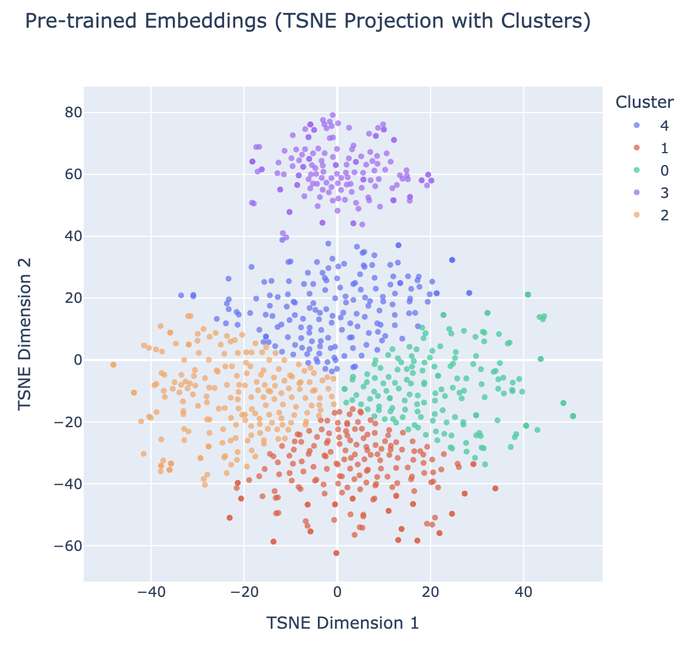
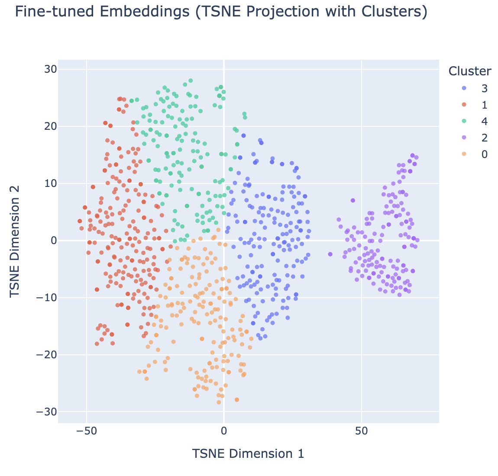
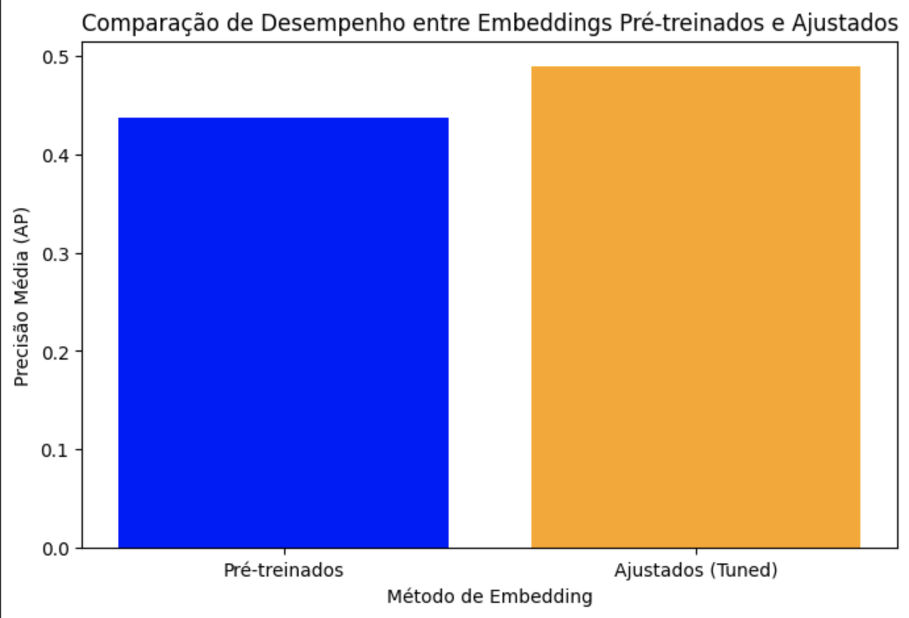
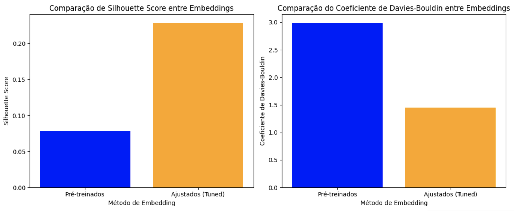

# Sephora Reviews Embeddings

## APS2 - Natural Language Processing 2024.2

**Professor:** Tiago Fernandes Tavares

**Alunos:** Ellen Shen e João Magalhaẽs

## Estrutura das Pastas
- `/data`: Contém os arquivos de dados, incluindo o dataset de avaliações da Sephora.
- `/notebooks`: Jupyter notebooks com experimentos e análises exploratórias.
- `/models`: Armazena o autoencoder treinado e outros modelos usados no projeto.
- `/src`: Código-fonte do projeto, incluindo scripts para geração de embeddings, treinamento do autoencoder e métricas de avaliação.
- `/results`: Resultados dos testes e avaliações, incluindo gráficos de comparação e métricas.

## Requisitos

Antes de rodar o projeto, instale as dependências listadas no arquivo `requirements.txt`. Certifique-se de estar em um ambiente virtual Python.

```bash
pip install -r requirements.txt
```

## Introdução
Este projeto foi desenvolvido como parte da APS 2 e explora técnicas de busca baseada em vetores, utilizando embeddings gerados por modelos de linguagem. O objetivo é representar textos (neste caso, avaliações de produtos da Sephora) em um espaço vetorial de modo que a proximidade entre vetores capture semelhanças semânticas. Esse sistema de recuperação de informações permite consultas mais precisas, comparando vetores gerados a partir de consultas com os vetores de documentos do dataset.

## Step 1: Encontrar Embeddings

### Descrição Dataset

O dataset utilizado neste projeto, sephora_reviews.csv, contém avaliações de produtos da Sephora. Cada entrada inclui uma avaliação textual, que pode abordar aspectos variados do produto, como qualidade, eficácia e satisfação do usuário. Essas avaliações são valiosas para entender as opiniões dos clientes e identificar padrões no feedback, pois fornecem informações textuais não estruturadas que refletem as experiências e sentimentos dos diferentes usuários. Este dataset é adequado para análise de embeddings, pois permite explorar as relações semânticas entre as avaliações.

---

### Processo de Geração de Embedding

Utilizamos o modelo pré-treinado SBERT (paraphrase-multilingual-MiniLM-L6-v2) para transformar cada avaliação em um vetor de 384 dimensões, capturando relações semânticas gerais. Para ajustar esses embeddings ao nosso dataset específico, aplicamos um autoencoder com funções de ativação ReLU nas camadas ocultas. A arquitetura do autoencoder é composta por um encoder que reduz a dimensionalidade de 384 para 256 e, em seguida, para 128, seguido por uma camada latente de 128 dimensões; o decoder reconstrói os embeddings, expandindo para 256 e, finalmente, para 384 dimensões. O modelo foi treinado com uma taxa de aprendizado de 0.001 por 30 épocas, buscando uma representação compacta e relevante para as características das avaliações da Sephora.

**Hiperparâmetros do Autoencoder:**

- Dimensões: Encoder (384 → 256 → 128), Latente (128), Decoder (128 → 256 → 384)
- Função de Ativação: ReLU
- Taxa de Aprendizado: 0.001
- Épocas: 30

**Topologia da Rede Neural**

  

---

### Processo de Treinamento

O autoencoder foi treinado utilizando o erro quadrático médio (MSE) como função de perda, que mede a diferença média ao quadrado entre os embeddings originais e suas versões reconstruídas. Essa função de perda é apropriada para nossa tarefa, pois incentiva o modelo a minimizar o erro de reconstrução, garantindo que o autoencoder capture as informações essenciais dos embeddings enquanto remove ruídos e enfatiza características específicas do dataset. Ao minimizar o MSE, o modelo aprende a gerar embeddings mais significativos no contexto das avaliações de produtos, facilitando a análise de similaridade e o agrupamento.

Equação: A função de perda de erro quadrático médio (MSE) $L$ é definida como:

$$L = \frac{1}{n} \sum_{i=1}^{n} (x_i - \hat{x}_i)^2$$


onde $$x_i$$ é o valor original do embedding e $$\hat{x}_i$$ é o valor reconstruído e $n$ é o número total de elementos no embedding.

---

## Step 2: Visualização dos Embeddings

1. **Pre-Trained Embeddings**

     

   O gráfico mostra os embeddings gerados pelo modelo SBERT pré-treinado. Cada ponto no gráfico representa uma avaliação, com sua posição determinada pelo embedding inicial gerado pelo SBERT. 

2. **Fine-Tuned Embeddings**

     

   O gráfico mostra os embeddings após o ajuste fino pelo autoencoder. Este ajuste visa tornar os embeddings mais representativos das características específicas do dataset da Sephora, aproximando avaliações semelhantes e destacando nuances relevantes no espaço vetorial.

---

### Discussão

Na **Figura 1** (Embeddings Pré-treinados), observamos clusters formados pela aplicação de TSNE e KMeans aos embeddings do SBERT sem ajuste fino. Embora existam alguns agrupamentos, a separação entre eles não é muito clara, o que indica que o modelo SBERT captura relações semânticas amplas nos textos. No entanto, há uma sobreposição perceptível entre os clusters, e a estrutura geral é difusa. Isso ocorre porque o modelo pré-treinado, embora eficiente para capturar semântica geral da linguagem, não está adaptado às nuances específicas das avaliações de produtos da Sephora em português. Assim, esses clusters podem refletir padrões de linguagem genéricos ou temas amplos, mas podem não diferenciar precisamente tópicos específicos dos produtos ou variações de sentimentos.

Na **Figura 2** (Embeddings Ajustados), os clusters apresentam uma separação mais definida e uma estrutura mais clara. O processo de ajuste fino aprimorou os embeddings, tornando-os mais representativos das características semânticas específicas do dataset de avaliações da Sephora. Como resultado, os clusters agora são mais distintos, com menos sobreposição, sugerindo que o ajuste fino permitiu ao modelo identificar divisões mais significativas, baseadas no conteúdo real e no contexto das avaliações. Esses clusters provavelmente estão organizados em torno de temas relevantes aos produtos da Sephora, como categorias de produtos, preocupações específicas com cuidados de pele ou variações de sentimento. Essa estrutura aprimorada indica que os embeddings ajustados são mais adequados para tarefas que exigem uma compreensão precisa do conteúdo das avaliações, como recomendação de produtos ou busca baseada em similaridade.

---

## Step 3: Busca Semântica

### Resultados dos Testes

1. **Test with Query that Yields 10 Results**
   - **Query**: `"acne"`
   - **Análise**: Este teste resultou em exatamente 10 itens, todos com uma similaridade alta com a consulta "acne". Os produtos retornados são majoritariamente relacionados à limpeza e tratamento facial, o que é relevante para o contexto de tratamento de acne. Os produtos incluem géis de limpeza, tonificantes e cremes específicos para problemas de pele, refletindo bem o tipo de conteúdo procurado.

   - **Resultados**:
     | Nome                                                  | Similarity |
     | ----------------------------------------------------- | ---------- |
     | GEL DE LIMPEZA FACIAL ANTI-IMPERFEIÇÕES SEPHORA...    | 0.942546   |
     | TÔNICO ROSE INC SKIN RESOLUTION CLARIFYING TONER      | 0.937030   |
     | ÓLEO FACIAL HIDRATANTE DRUNK ELEPHANT VIRGIN M...     | 0.935236   |
     | CREME COM CERAMIDAS PARA OS OLHOS DRUNK ELEPHA...     | 0.933941   |
     | MOUSSE GEL DE LIMPEZA GEL ÉCLAT                       | 0.933483   |
     | DOUBLE SÉRUM AVANÇADO GUERLAIN ABEILLE ROYALE         | 0.929882   |
     | ESPUMA DE LIMPEZA SHISEIDO DEEP CLEANSING FOAM        | 0.928371   |
     | CREME PARA OLHOS ROSE INC EYE REVIVAL BRIGHTEN...     | 0.927898   |
     | ÓLEO REJUVENESCEDOR AVANÇADO GUERLAIN ABEILLE ...     | 0.927219   |
     | FUTURE SOLUTION LX EXTRA RICH CLEANSING FOAM ...      | 0.927122   |

2. **Test with Query that Yields Less than 10 Results**
   - **Query**: `"seco"`
   - **Análise**: Esta consulta retornou apenas 2 resultados, refletindo produtos altamente relacionados a hidratação e combate à pele seca. O baixo número de resultados sugere que poucos produtos possuem uma correspondência forte com o termo "seco" no contexto dos dados, indicando que o sistema consegue aplicar bem o filtro de similaridade e retornando apenas os itens mais relevantes.

   - **Resultados**:
     | Nome                                                  | Similarity |
     | ----------------------------------------------------- | ---------- |
     | CREME DE LIMPEZA DERMALOGICA MICELLAR PREBIOTI...     | 0.911386   |
     | CONCENTRADO HIDRATANTE MOISTURE SURGE                 | 0.901117   |

3. **Test with Query that Yields Non-Obvious Results**
   - **Query**: `"manchas na pele"`
   - **Análise**: Nesta consulta mais complexa, a busca retornou 10 produtos que, embora não mencionem diretamente "manchas", estão fortemente associados a cuidados e limpeza profunda, como balms demaquilantes, óleos e espumas de limpeza. Isso indica que o sistema é capaz de capturar a semântica por trás de termos relacionados ao tratamento de manchas, sugerindo produtos que contribuem para uma rotina de cuidados faciais que pode tratar ou prevenir manchas.

   - **Resultados**:
     | Nome                                                  | Similarity |
     | ----------------------------------------------------- | ---------- |
     | BALM DEMAQUILANTE TAKE THE DAY OFF                    | 0.967102   |
     | ÓLEO DE LIMPEZA GUERLAIN ANTI-POLUIÇÃO ABEILLE...     | 0.966397   |
     | ESPUMA DE LIMPEZA CAUDALIE VINOCLEAN                  | 0.964809   |
     | HIDRATANTE EM GEL MOISTURE SURGE ™ 100H CLINIQUE      | 0.964466   |
     | ESPUMA DE LIMPEZA SHISEIDO DEEP CLEANSING FOAM        | 0.964270   |
     | CREME HIDRATANTE FACIAL DRUNK ELEPHANT PROTINI...     | 0.964127   |
     | ESPUMA DE LIMPEZA CLARINS TOTAL RENEWING FOAMI...     | 0.962758   |
     | PEELING LÍQUIDO ESFOLIANTE DERMALOGICA PEELFOL...     | 0.962387   |
     | GEL CORRETIVO PARA VERMELHIDÃO CALMANTE CLARIN...     | 0.962225   |
     | SÉRUM REPARAÇÃO DIÁRIA ABEILLE ROYALE                 | 0.961549   |


### Conclusão

Os resultados dos três testes mostram que o sistema de busca semântica é capaz de captar tanto correspondências diretas quanto associações semânticas mais sutis. Para a consulta "acne", o sistema retornou uma lista completa de produtos diretamente relacionados, enquanto para "seco", a lista foi limitada a apenas dois itens altamente relevantes. Na consulta complexa "manchas na pele", o sistema identificou produtos que, embora não mencionem explicitamente "manchas", podem fazer parte de uma rotina que aborda essa questão, demonstrando a capacidade do sistema em capturar nuances e oferecer recomendações úteis para o usuário. 

---

## Step 4: Make it Nicer!

### Machine Learning Engineering


###  Comparação de Desempenho

  


No gráfico acima, observamos que a precisão média (AP) dos embeddings ajustados é ligeiramente superior à dos embeddings pré-treinados. Isso indica que o ajuste fino com o autoencoder pode ter capturado características mais relevantes para os dados específicos do problema, o que melhorou o desempenho na tarefa de classificação. Esse aumento na precisão pode significar que os embeddings ajustados conseguem captar melhor as nuances dos textos do dataset, especialmente quando aplicados a uma tarefa com rótulos artificiais.

No entanto, é importante destacar que a diferença entre os embeddings pré-treinados e os ajustados não é muito grande. Isso pode sugerir que os embeddings SBERT pré-treinados já capturam uma representação semântica bastante robusta, e o ajuste fino com o autoencoder pode não trazer um ganho significativo em todos os contextos. Esse resultado reforça a importância de experimentar diferentes abordagens e medir o impacto do ajuste fino para verificar se ele traz melhorias mensuráveis no desempenho de uma tarefa específica.

---

###  Métricas de Agrupamento

 

Os gráficos de Silhouette Score e Coeficiente de Davies-Bouldin destacam a diferença na qualidade dos clusters entre os embeddings pré-treinados e os ajustados (tuned). No primeiro gráfico, observamos que o Silhouette Score é significativamente mais alto para os embeddings ajustados, o que indica que eles formam clusters mais coesos e bem separados. Em contraste, os embeddings pré-treinados apresentam um Silhouette Score mais baixo, sugerindo que os clusters são menos definidos e com menos separação entre si. Esse resultado sugere que o ajuste fino com o autoencoder ajuda a capturar melhor as semelhanças semânticas dos textos, resultando em agrupamentos mais coerentes.

O segundo gráfico, do Coeficiente de Davies-Bouldin, reforça essa observação ao mostrar uma diferença notável entre os dois tipos de embeddings. Um valor menor para os embeddings ajustados indica clusters mais compactos e bem separados, enquanto o valor mais alto dos embeddings pré-treinados sugere que esses clusters são mais dispersos e se sobrepõem mais. Em conjunto, essas métricas indicam que o ajuste fino dos embeddings com o autoencoder melhora a qualidade da estrutura de agrupamento, tornando-os mais adaptados às particularidades do dataset. Isso é particularmente útil em aplicações onde uma estrutura de clusters clara é essencial para a análise semântica ou para o desempenho de tarefas de busca e recomendação.

---